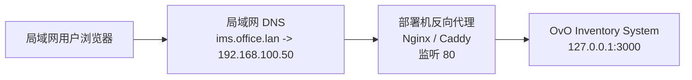

# 局域网DNS与反向代理访问方案

## 1. 目标

在**不对外网开放**的前提下，让局域网内用户通过统一域名访问物料管理系统，而不是直接使用：

- `http://192.168.x.x:3000`
- `http://localhost:3000`

目标访问形式：

- `http://ims.office.lan`
- `http://ovo-wms.local`

本方案只调整：

- 局域网 DNS 解析
- 部署机反向代理
- 网络与访问配置

**不修改项目业务代码。**

---

## 2. 适用场景

适合以下情况：

- 系统已部署在一台固定的 Windows 电脑上
- 访问范围仅限办公室、仓库、车间等局域网环境
- 多个用户需要统一地址访问系统
- 希望后续扩展 HTTPS、统一入口、切换服务器时更容易维护

---

## 3. 推荐架构



说明：

- 用户只访问域名
- DNS 负责把域名解析到部署机内网 IP
- 反向代理负责把 `80` 端口请求转发到系统本体 `3000`
- 物料系统本身仍继续运行在 `127.0.0.1:3000`

---

## 4. 方案组成

### 4.1 系统本体

当前物料系统继续保持：

- 运行地址：`http://127.0.0.1:3000`

不要求修改：

- 路由
- API
- 前端代码
- 数据库

### 4.2 局域网 DNS

在局域网可控的 DNS 设备中增加一条解析记录，例如：

- `ims.office.lan -> 192.168.100.50`

可实现 DNS 的设备包括：

- 企业路由器
- Windows DNS 服务器
- OpenWrt / 软路由
- AdGuard Home
- Pi-hole

### 4.3 反向代理

在部署机上安装：

- `Nginx`
- 或 `Caddy`

作用：

- 监听 `80`
- 接收域名请求
- 反向代理到 `127.0.0.1:3000`

最终访问形式：

- `http://ims.office.lan`

---

## 5. 部署前准备

### 5.1 固定部署机内网 IP

必须先给部署机固定内网 IP，例如：

- `192.168.100.50`

否则 DNS 指向会漂移，域名会失效。

### 5.2 确定域名规则

建议使用局域网专用命名，例如：

- `ims.office.lan`
- `ovo-wms.local`
- `inventory.factory.lan`

建议避免：

- 直接使用公网正式域名
- 使用过长或难记的地址

### 5.3 确认端口策略

建议：

- 系统本体继续监听 `3000`
- 对用户只暴露 `80`

这样用户不需要记端口。

---

## 6. DNS 配置建议

### 6.1 建议记录

示例：

```txt
主机名: ims
域: office.lan
记录类型: A
指向: 192.168.100.50
```

最终效果：

- `ims.office.lan -> 192.168.100.50`

### 6.2 生效验证

在任意局域网客户端执行：

```bash
ping ims.office.lan
```

预期结果：

- 解析到部署机内网 IP

---

## 7. 反向代理配置建议

## 7.1 Nginx 示例

```nginx
server {
    listen 80;
    server_name ims.office.lan;

    location / {
        proxy_pass http://127.0.0.1:3000;
        proxy_http_version 1.1;

        proxy_set_header Host $host;
        proxy_set_header X-Real-IP $remote_addr;
        proxy_set_header X-Forwarded-For $proxy_add_x_forwarded_for;
        proxy_set_header X-Forwarded-Proto $scheme;
    }
}
```

### 7.2 Caddy 示例

```caddy
ims.office.lan {
    reverse_proxy 127.0.0.1:3000
}
```

### 7.3 推荐选择

如果现场没有专门运维人员，推荐：

- **Caddy**

原因：

- 配置更少
- 维护简单
- 后续扩 HTTPS 更轻松

如果现场已经熟悉 Nginx，则继续用 Nginx 即可。

---

## 8. 当前项目相关配置建议

本方案原则上不改代码，但部署时建议确认以下配置：

- `.env`
- `PORT`
- `COOKIE_SECURE`
- `TRUST_PROXY`

### 8.1 推荐口径

在当前局域网 HTTP 部署下：

```env
PORT=3000
COOKIE_SECURE=false
TRUST_PROXY=1
```

说明：

- `PORT=3000`：系统本体继续在 3000
- `COOKIE_SECURE=false`：局域网 HTTP 访问时避免登录态异常
- `TRUST_PROXY=1`：经过反向代理时，服务端能正确识别代理链

如果以后切换到 HTTPS，再重新评估：

- `COOKIE_SECURE=true`

---

## 9. 防火墙与网络要求

部署机至少需要允许：

- `80` 端口被局域网访问

如果还保留直接调试访问，则可选开放：

- `3000`

正式给用户使用时建议：

- 用户只走域名和 `80`
- `3000` 仅限运维或本机调试

---

## 10. 用户访问方式

上线后统一要求用户使用：

- `http://ims.office.lan`

不要混用：

- IP 地址访问
- localhost 访问
- 带端口访问

这样有利于：

- 登录态稳定
- 故障排查统一
- 用户培训简单

---

## 11. 验收步骤

上线后按以下顺序验证：

### 11.1 DNS 验证

在局域网客户端：

```bash
ping ims.office.lan
```

确认解析到部署机 IP。

### 11.2 首页验证

浏览器打开：

- `http://ims.office.lan`

应能正常打开首页。

### 11.3 健康检查验证

打开：

- `http://ims.office.lan/api/health`

预期结果：

- `status: healthy`

### 11.4 登录验证

验证：

- 能正常登录
- 刷新后登录态不丢失

### 11.5 核心业务验证

至少走一遍：

- 入库单查询
- 出库单查询
- 物料页面
- 历史采购记录

---

## 12. 风险与注意事项

### 12.1 DNS 未固定

如果部署机 IP 没固定，域名会指错机器。

### 12.2 Cookie 登录态

如果 `COOKIE_SECURE` 配错，可能出现：

- 能登录
- 刷新后掉登录态

### 12.3 代理头未配置

如果反向代理头部没带好，后续做审计、日志、IP 获取时会不准确。

### 12.4 用户混用多种访问方式

如果有人访问：

- `localhost`
- `IP:3000`
- `域名`

会增加登录态和故障排查混乱。

---

## 13. 推荐实施顺序

1. 固定部署机内网 IP
2. 选定正式局域网域名
3. 在局域网 DNS 中加解析记录
4. 在部署机安装反向代理
5. 配置 `80 -> 127.0.0.1:3000`
6. 校验 `.env` 中 `COOKIE_SECURE / TRUST_PROXY`
7. 做首页、健康检查、登录、核心业务验收
8. 通知用户统一改用域名访问

---

## 14. 结论

方案 A 是当前项目在局域网环境下最稳的域名访问方案：

- 不改业务代码
- 用户访问体验更统一
- 后续扩展 HTTPS 和切换服务器更方便

一句话：

**系统继续跑在 3000，局域网 DNS 负责域名解析，反向代理负责对外提供统一域名入口。**
